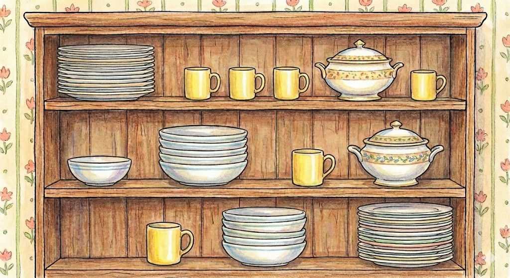

# Тренувальна задача

Розробити сторінку, яка візуалізує полицю з посудом, і адмінку для неї. База даних і адмінка дозволяє зберігати (
керувати) інформацією про полиці, посуд, і його розташування на полицях.
Зверніть увагу, що позиції посуду на полицях не є фіксованими клітинками.
Приклад полиці нижче. Графіка не важлива, важлива структура БД та робота коду.

Реалізуйте на Symfony, в якості адмінки можете використати easyAdmin, або іншу технологію на ваш розсуд.
Функціонал і БД можна створити за допомогою ШІ (Codex / Cursor) в режимі промптування. Але важливо, щоб ви могли
пояснити і захистити отримані рішення.
Роботу достатньо продемонструвати на вашій локальній машині + надати структуру БД + доступ до репозиторію.
